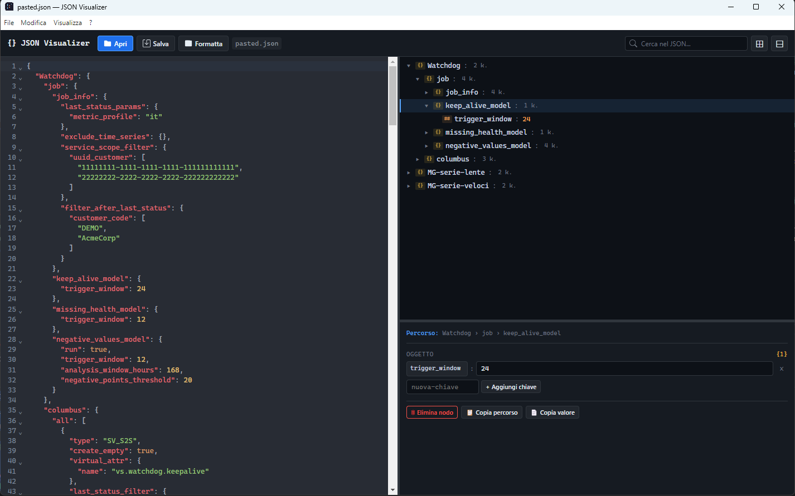

# JSON Visualizer

Editor visuale per file JSON complessi, ottimizzato per le configurazioni Columbus delle analitiche.



---

## Scarica e usa (utenti)

Non serve installare nulla, niente Node.js, niente terminale.

1. Vai alla pagina **[Releases](../../releases)** del repository
2. Scarica l'ultima versione:
   - `JSON Visualizer x.x.x.exe` — **portabile**, doppio click e parte
   - `JSON Visualizer Setup x.x.x.exe` — **installer** (crea shortcut Start/Desktop)
3. Apri l'app e trascina dentro un file `.json`

> **SmartScreen Windows**: alla prima esecuzione potresti vedere "Windows ha protetto il PC". Clicca **Ulteriori informazioni → Esegui comunque**. L'eseguibile non è firmato (firma costa ~300€/anno) ma è sicuro.

Per provare subito senza un tuo file: usa `examples/example.json` dal repository.

---

## Funzionalità

| Feature | Dettaglio |
|---|---|
| **Editor JSON** | Syntax highlighting, bracket matching, autocomplete (CodeMirror 6) |
| **Albero interattivo** | Espandi/comprimi, icone e colori per tipo, navigazione click |
| **Pannello proprietà** | Modifica inline di valori, aggiunta/rimozione di chiavi e array items |
| **UUID Chips** | UI dedicata per `uuid_dispatchers_create` / `uuid_dispatchers_delete` |
| **Ricerca** | Filtra istantaneamente l'albero per chiave o valore |
| **Sync bidirezionale** | Modifiche nell'editor aggiornano l'albero e viceversa |
| **Drag & Drop** | Trascina un file `.json` direttamente nella finestra |
| **Salvataggio** | Scarica il JSON modificato, mantiene la formattazione |
| **Menu contestuale** | Tasto destro su qualsiasi nodo: copia percorso, copia valore, elimina |
| **App desktop** | Build come app Electron con installer Windows, senza bisogno del browser |

---

## Come si usa

### Aprire un file
- **Toolbar → Apri**: file picker
- **Drag & Drop**: trascina `.json` nella finestra
- **Ctrl+O**: shortcut

### Navigare l'albero
- **Clic su `▶`**: espande/comprime un nodo
- **Clic sul nodo**: seleziona e mostra il pannello proprietà in basso a destra
- **Tasto destro**: menu contestuale (copia percorso, copia valore, elimina)
- **Pulsanti `⊞ / ⊟`** in toolbar: espandi/comprimi tutto
- **Barra di ricerca**: filtra nodi per chiave o valore in tempo reale

### Modificare i valori
1. Clicca un nodo nell'albero
2. Pannello Proprietà (in basso a destra) mostra controlli per quel nodo:
   - **Primitivi** (string, number, boolean, null): input diretto, cambio tipo
   - **Array**: lista con `×` per rimuovere, `+ Aggiungi elemento`
   - **uuid_dispatchers_create / delete**: chips UUID con `×` e campo per aggiungere
   - **Oggetti**: tabella chiave-valore con aggiunta/rimozione chiavi
3. Modifiche si propagano all'editor JSON a sinistra

### Salvare
- **Toolbar → Salva** o **Ctrl+S**
- File scaricato col nome originale
- Pallino `●` in toolbar = modifiche non salvate

### Ridimensionare i pannelli
Divisori trascinabili tra pannelli:
- **Verticale centrale**: editor vs albero+proprietà
- **Orizzontale destra**: altezza albero vs pannello proprietà

---

## Scorciatoie da tastiera

| Tasto | Azione |
|---|---|
| `Ctrl+O` | Apri file |
| `Ctrl+S` | Salva file |
| `Ctrl+Shift+F` | Formatta JSON |
| `Delete` | Elimina nodo selezionato (fuori da input) |
| `Escape` | Chiudi menu contestuale |

---

## Struttura JSON Columbus supportata

```json
{
  "NomeJob": {
    "job": { "...": "parametri del job" },
    "columbus": {
      "all": [
        {
          "type": "SV_S2S",
          "virtual_attr": { "name": "vs.esempio.nome" },
          "uuid_dispatchers_create": ["uuid1", "uuid2"],
          "uuid_dispatchers_delete": ["uuid3"]
        }
      ],
      "uuid-cliente-specifico": [ "...stessa struttura, override per customer..." ]
    }
  }
}
```

---

## Build da sorgente (sviluppatori)

### Requisiti

- **Node.js** ≥ 18 → [scarica versione LTS](https://nodejs.org/)
- **npm** ≥ 9 (incluso con Node.js)
- **Git** → [scarica](https://git-scm.com/)

Verifica installazione:
```bash
node --version    # v18.x o superiore
npm --version     # 9.x o superiore
git --version
```

### Clone e installazione

```bash
git clone https://github.com/<steDamma>/json-visualizer.git
cd json-visualizer
npm install
```

### Sviluppo (browser)

```bash
npm run dev          # dev server su http://localhost:5173
npm run build        # build produzione in dist/
npm run preview      # anteprima della build
```

### Sviluppo (app desktop)

```bash
npm run electron:dev               # finestra Electron con hot-reload
npm run electron:build             # installer NSIS + portabile in release/
npm run electron:build:portable    # solo portabile (più veloce)
```

Output di `electron:build` in `release/`:

| File | Tipo |
|---|---|
| `JSON Visualizer Setup x.x.x.exe` | Installer NSIS (Program Files, shortcut Start/Desktop) |
| `JSON Visualizer x.x.x.exe` | Eseguibile portabile (zero-install) |

### Icona personalizzata (opzionale)

Di default il build usa l'icona default Electron. Per un'icona custom:

1. Crea `public/icon.ico` (256×256, formato ICO) — conversione PNG → ICO: [convertio.co](https://convertio.co/it/png-ico/)
2. Aggiungi al `package.json` nella sezione `build.win`:
   ```json
   "icon": "public/icon.ico"
   ```
3. Per macOS: `public/icon.icns` + `"icon"` in `build.mac`
4. Per Linux: `public/icon.png` (512×512) + `"icon"` in `build.linux`

Le icone sono in `.gitignore` di default per non committare branding personale.

### Distribuzione

Condividi `.exe` portabile o installer dalla cartella `release/`. App self-contained: include Node.js e Chromium, non richiede nulla sulla macchina destinataria.

---

## Troubleshooting

**`npm install` fallisce con `EACCES` o `permission denied`**
Su Windows: chiudi editor/IDE che tengono lock su `node_modules/`, riprova in PowerShell come amministratore.

**Porta 5173 già occupata**
Altra istanza Vite attiva. Chiudila o avvia su altra porta:
```bash
npm run dev -- --port 5174
```

**`electron:build` fallisce con `icon.ico not found`**
Hai aggiunto `"icon"` in `package.json` ma il file non esiste. Crea `public/icon.ico` o rimuovi la riga `"icon": ...` da `package.json` per tornare al default.

**Antivirus blocca `.exe` portabile**
Eseguibile non firmato. Aggiungi eccezione in antivirus o firma il binario con certificato code-signing.

**App si apre ma JSON non si carica**
File JSON malformato. Apri DevTools (Ctrl+Shift+I in dev, oppure menu Visualizza in prod) e controlla console.

**Modifiche nell'editor non aggiornano l'albero**
Debounce di 350ms — attendi. Se persiste, JSON non è valido (la barra di stato mostra errore parse).

---

## Architettura

```
src/
├── main.ts                    # Bootstrap, wiring toolbar
├── store/
│   ├── AppStore.ts            # Unica sorgente di verità (JSON + selezione)
│   └── EventBus.ts            # Pub/sub tipizzato (store:change, node:select, …)
├── services/
│   ├── JsonPatchService.ts    # Lettura/scrittura JSON Pointer (RFC 6901)
│   └── FileService.ts         # Open/save file, drag & drop
├── components/
│   ├── JsonEditor.ts          # CodeMirror 6 wrapper, sync con store
│   ├── TreeView.ts            # Albero interattivo con event delegation
│   ├── PropertiesPanel.ts     # Form dinamico per il nodo selezionato
│   └── SplitPane.ts           # Divisori draggabili
└── utils/
    ├── typeDetect.ts           # Rilevamento tipo JSON, badge, UUID
    ├── toast.ts                # Notifiche temporanee
    └── escape.ts               # Escape HTML
```

### Flusso dati

```
[CodeMirror] → (debounce 350ms, JSON.parse) → [AppStore] → EventBus "store:change"
                                                                      │
                                              ┌───────────────────────┼────────────────────┐
                                              ▼                       ▼                    ▼
                                        [JsonEditor]            [TreeView]        [PropertiesPanel]
                                        (aggiorna doc)        (re-render tree)    (re-render form)

[TreeView / PropertiesPanel] → AppStore.applyPatch() → EventBus "store:change" → [JsonEditor aggiorna]
```

Guardia su **origin** (`'editor'` vs `'properties'`/`'tree'`) previene loop infiniti di aggiornamento.

### Tecnologie

| Libreria | Versione | Scopo |
|---|---|---|
| [Vite](https://vitejs.dev/) | 6.x | Build tool + dev server |
| [TypeScript](https://www.typescriptlang.org/) | 5.x | Tipizzazione statica |
| [CodeMirror 6](https://codemirror.net/) | 6.x | Editor JSON con syntax highlighting |
| [Electron](https://www.electronjs.org/) | 33.x | Wrapper desktop |
| CSS custom | — | Dark theme, layout, componenti |

Nessun framework UI (React/Vue/Angular): vanilla TypeScript con DOM manipulation diretta.

---

## Estendere il supporto a strutture custom

Per riconoscere altri pattern specifici (es. altri tipi di array speciali), modifica `src/utils/typeDetect.ts`:

```typescript
export function isUuidArrayKey(key: string): boolean {
  return key === 'uuid_dispatchers_create'
      || key === 'uuid_dispatchers_delete'
      || key === 'mia_lista_speciale';  // <-- aggiungi qui
}
```

Vedi `CLAUDE.md` per la guida completa allo sviluppo.

---

## Licenza

[MIT](LICENSE)
